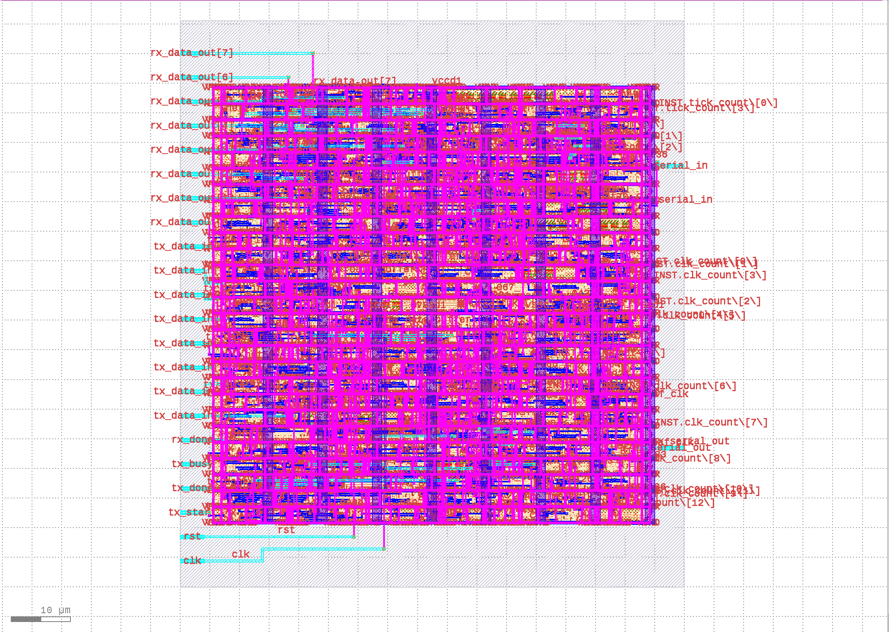
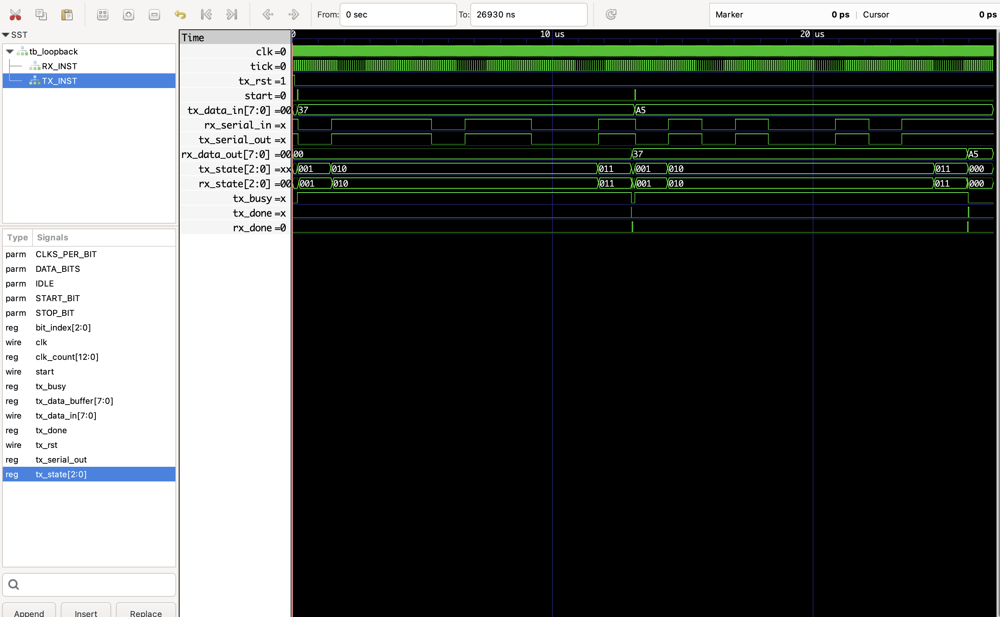
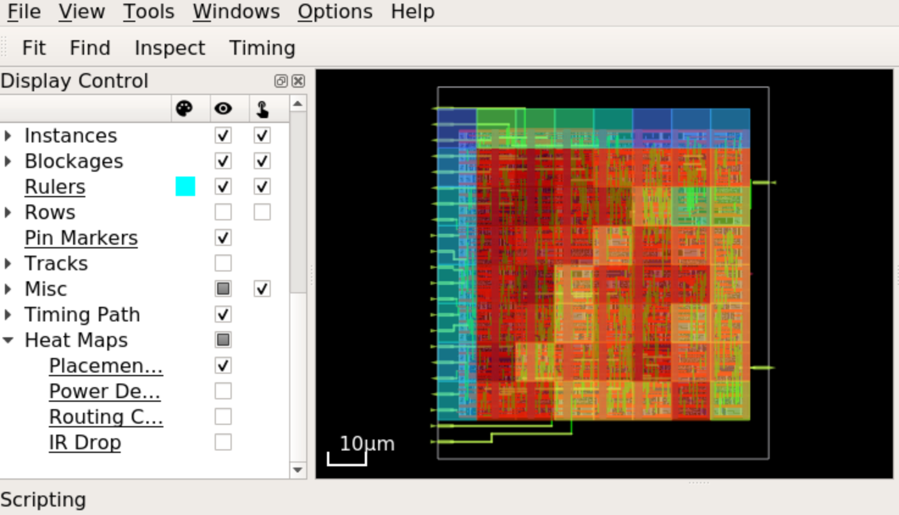
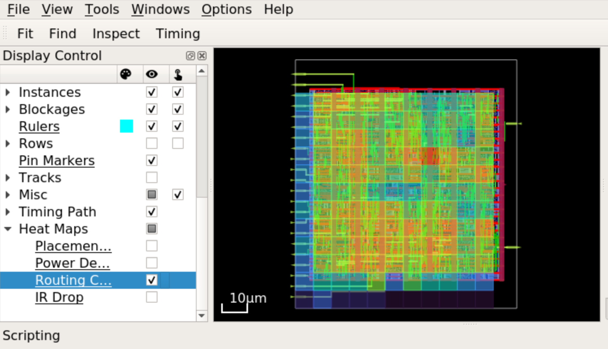

# High-Density UART IP Core (Sky130 Hardened)

  

## 1. Project Overview
This repository contains the RTL-to-GDSII flow for a **Universal Asynchronous Receiver-Transmitter (UART)**, hardened using the SkyWater 130nm PDK and OpenLane flow.

The design was optimized for **High Density (79% Utilization)** while maintaining signal integrity and valid timing at standard baud rates. It features a fully verified register map, separate TX/RX datapaths, and a loopback test mode.

### 🌟 Final Layout (GDSII)


---

## 2. Key Performance Metrics
| Metric | Value | Unit | Notes |
| :--- | :--- | :--- | :--- |
| **Technology Node** | SkyWater 130nm | - | Open Source PDK |
| **Clock Frequency** | 50 | MHz | Standard |
| **Core Utilization** | **79** | % | High Density Optimization |
| **Setup Slack** | +14.84 | ns | Timing Clean |
| **Hold Slack** | +0.24 | ns | Timing Clean |
| **DRC Violations** | **0** | - | Manufacture Ready |

---

## 3. Directory Structure
This repository is organized to separate Source Code, Verification, and Physical Implementation results.

```text
├── src/            # Verilog Source Code & OpenLane Configs
│   ├── uart_top.v      # Top-level module
│   ├── config.tcl      # OpenLane configuration
│   └── pin_order.cfg   # Pin placement constraints
├── dv/             # Design Verification (Testbenches & Waves)
│   ├── tb_uart_tx.v    # Transmitter Testbench
│   ├── tb_loopback.v   # Full Loopback Testbench
│   └── waveform_view.jpg # Waveform Screenshot
├── results/        # Hardened Artifacts (The "Proof")
│   ├── uart_top.gds    # Final Layout File
│   ├── drc.rpt         # Sign-off DRC Report
│   └── timing.log      # Static Timing Analysis (STA) Logs
└── docs/           # Documentation & Plots
    └── images/         # Heatmaps and Layouts 

## 4. Functional Verification
The design functionality was verified through Simulation and Waveform Analysis.
The testbenches generated signal patterns for Transmission (TX) and Reception (RX). The output waveforms were manually inspected to verify:

1. Correct Start/Stop bit generation.
2. Accurate baud rate timing.
3. Data integrity during Loopback mode.

### Waveform Analysis
| Transmitter (Tx) Test | Receiver (Rx) Test |
| :---: | :---: |
|  |  |

**Loopback Mode Verification:**


---

## 5. Physical Design & Sign-off
The layout was pushed to **79% core utilization** to test the limits of the Sky130 routing resources. Despite the high density, the design is DRC clean and routing congestion is minimal.

### Congestion & Density Analysis
| Placement Density | Routing Congestion |
| :---: | :---: |
|  |  |
| *Heatmap showing 79% logic density* | *Clean routing channels (Blue/Green)* |
